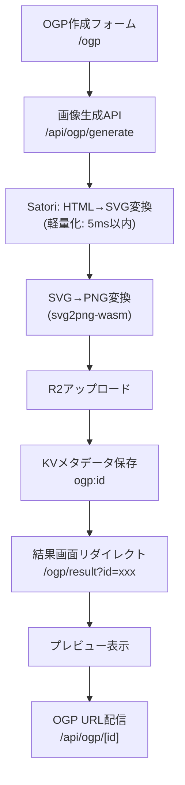

# OGP画像生成サービス 要件定義書

## プロジェクト概要

**要望ID**: ogp-001  
**タイトル**: Hono + HonoXを使ってOGP画像作成サービスを作りたい  
**概要**: 動的OGP画像生成サービス（記事タイトル、アイコン、著者、背景画像、グラデーション対応）

---

## 要件ジャッジ結果

### ✅ **実施判定**: Yes
- **優先度**: 高
- **判断理由**: 
  - 個人開発規模で技術的実現可能性あり
  - 既存サービスとの差別化要素（デザイン品質）
  - Cloudflare Free版での段階的実装が可能

### 📊 **影響範囲**
- **新規画面**: 3画面（作成フォーム、結果表示、画像配信）
- **新規API**: 2エンドポイント
- **新規ライブラリ**: 4個（satori、yoga-wasm-web、svg2png-wasm、wasm-image-optimization）
- **インフラ**: R2バケット、KV追加

---

## 変更対象ファイル・関数リスト

### 新規作成ファイル

#### **画面・ルーティング**
- `app/routes/ogp/index.tsx` - OGP作成フォーム画面
- `app/routes/ogp/result.tsx` - 生成結果画面（クエリパラメータ: `?id=xxx`）
- `app/routes/api/ogp/generate.tsx` - OGP画像生成API
- `app/routes/api/ogp/[id].tsx` - OGP画像配信エンドポイント

#### **ライブラリ・ユーティリティ**
- `app/lib/ogp-generator.ts` - Satori使用の画像生成ロジック
- `app/lib/cloudflare.ts` - R2/D1/KV統合操作
- `app/lib/ogp-template.tsx` - OGPテンプレートJSX

#### **クライアントサイドコンポーネント**
- `app/islands/ogp-form.tsx` - OGP設定フォーム（リアルタイムプレビュー）

### 既存ファイル変更
- `package.json` - 依存関係追加
- `wrangler.jsonc` - R2バケット、KV設定追加

---

## データ設計方針

### KVストレージ設計（単体・MVP）

#### **キー設計**
- 画像メタデータ: `ogp:${id}`

#### **値の構造**
- 画像ID、R2 URL、生成パラメータ（タイトル、グラデーション等）
- 作成日時

#### **設定**
- **TTL**: 1年間（31536000秒）
- **容量制限**: Free版1GB（約100万件保存可能）

### R2バケット設計
- **バケット名**: `ogp-images/images`
- **公開設定**: CDN配信有効
- **ファイル命名**: `${id}_${Date.now()}_${titleHash}.png`（メタデータ埋め込み）

---

## 画面設計方針

### 1. OGP作成フォーム (`/ogp`)
- **UI**: Tailwind CSS 4.0使用
- **フィールド**: 
  - タイトル（必須）
  - グラデーション選択（プリセット）
  - アイコン画像（Phase 2）
  - 著者名（Phase 2）
- **プレビュー**: Islands componentでリアルタイム表示

### 2. 結果画面 (`/ogp/result?id=xxx`)
- **表示内容**: 
  - 生成画像プレビュー
  - OGP URL（コピー機能付き）
  - 保存ボタン
- **機能**: KVへの永続化、SNSシェア

### 3. 画像配信 (`/api/ogp/[id]`)
- **レスポンス**: PNG画像（Content-Type: image/png）
- **キャッシュ**: CDN + KVでの多層キャッシュ
- **TTL**: 1年間（immutable）

---

## 処理フロー



---

## 開発工数見積

### Phase 1: MVP（Free版対応）
| カテゴリ | タスク | 工数 |
|----------|--------|------|
| **基盤構築** | Satori WASM統合 | 4h |
| | svg2png-wasm統合 | 3h |
| | R2/KV操作ライブラリ | 4h |
| **画面開発** | OGP作成フォーム（基本） | 6h |
| | 結果・プレビュー画面 | 4h |
| | 画像配信API | 3h |
| **画像生成** | 固定テンプレート | 8h |
| **最適化** | Free版制限対応 | 4h |

**Phase 1合計**: 36時間 ≈ **4.5人日**

### Phase 2: 拡張機能
| カテゴリ | タスク | 工数 |
|----------|--------|------|
| **機能拡張** | アイコン画像対応 | 6h |
| | 著者名表示 | 2h |
| | 背景画像対応 | 8h |

**Phase 2合計**: 16時間 ≈ **2人日**

**総合計**: 52時間 ≈ **6.5人日**

---

## 段階的機能アップデート方針

### Phase 1: MVP（Cloudflare Free版完全対応）
- **機能**: タイトル + グラデーション背景のみ
- **制約**: 10ms CPU制限内で完結
- **技術**: Satori軽量化 + svg2png-wasm
- **ストレージ**: KVでメタデータ管理

### Phase 2: 基本拡張
- **機能**: アイコン画像 + 著者名追加
- **制約**: 引き続きFree版内
- **最適化**: 画像圧縮 + テンプレート効率化

### Phase 3: 高度機能（将来検討）
- **機能**: 背景画像アップロード
- **制約**: この段階でPaid版検討

---

## 技術スタック

### フロントエンド
- **フレームワーク**: HonoX (file-based routing)
- **スタイリング**: Tailwind CSS 4.0
- **クライアントサイド**: Islands Architecture

### バックエンド
- **ランタイム**: Cloudflare Workers
- **画像生成**: Satori + svg2png-wasm
- **ストレージ**: R2 + KV

### 依存関係
```json
{
  "satori": "^0.10.0",
  "yoga-wasm-web": "^0.3.0", 
  "svg2png-wasm": "^0.4.0",
  "wasm-image-optimization": "^1.0.0"
}
```

---

## Cloudflare制限対応策

### CPU時間制限（10ms）
- **Satoriテンプレート**: 超軽量化
- **フォント**: 事前用意1種類のみ
- **画像処理**: 最小限の変換処理

### メモリ制限（128MB）
- **画像サイズ**: 最大2MB制限
- **処理方式**: ストリーミング処理

### キャッシュ戦略
- **KVストレージ**: 生成済み画像のメタデータ保存
- **CDNキャッシュ**: Cloudflareエッジでの1年間キャッシュ
- **容量管理**: KV 1GB制限内での運用

---

## 未確定事項 & TODO

### 【要確認①】パフォーマンス検証
- [ ] 10ms制限内でのSatori+PNG変換実測テスト
- [ ] 複数同時リクエスト時の処理能力確認

### 【要確認②】フォント準備
- [ ] 日本語対応フォントファイルの準備
- [ ] フォントファイルサイズ vs Workers制限の確認

### 【要確認③】デザインテンプレート
- [ ] ogpsample.mdベースのデザイン調整
- [ ] グラデーションパターンの選定（3-5種類）

### 【要確認④】運用設計
- [ ] エラーハンドリング方針
- [ ] 画像の保持期間・削除ポリシー
- [ ] 監視・ログ設計

---

## 成功指標

### Phase 1目標
- [ ] 10ms以内での画像生成完了
- [ ] キャッシュヒット率 90%以上
- [ ] エラー率 1%以下

### Phase 2目標  
- [ ] 月間1万枚生成対応
- [ ] レスポンス時間 100ms以内
- [ ] ユーザビリティ向上